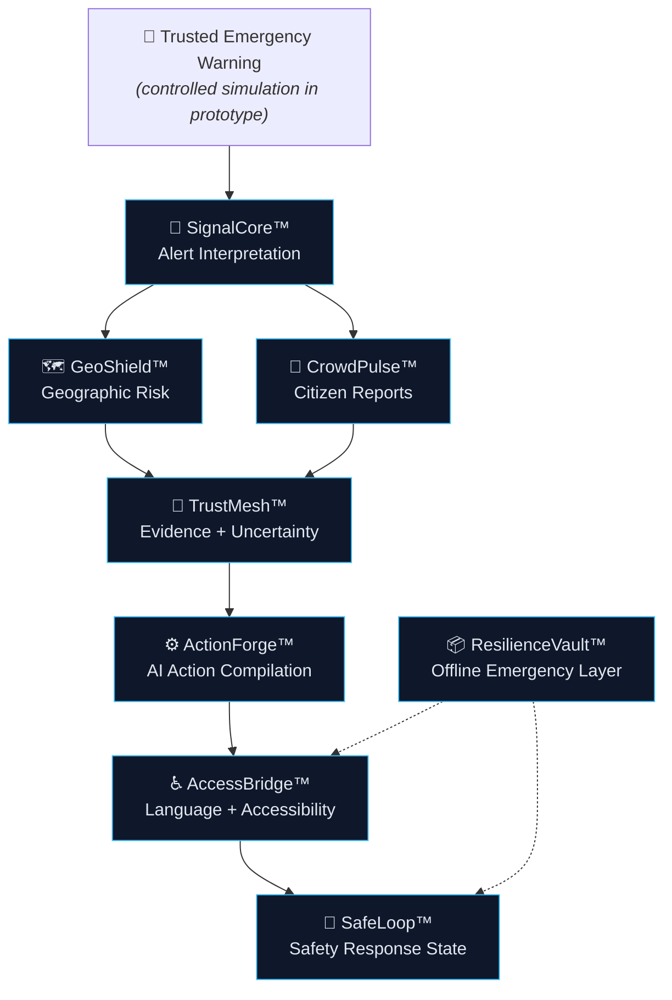

<div align="center">

# 🌉 SignalBridge

### From Warning to Evidence. From Evidence to Action. From Action to Safety.

**An AI-powered Emergency Intelligence and Action Platform that transforms trusted emergency warnings into personalized, evidence-linked and accessible action guidance.**
**Demo Link**https://signalbridgeai.onrender.com/


> **SignalBridge complements official emergency warning systems; it does not replace them.**

</div>

<!-- HERO VISUAL: after capturing a real screenshot, uncomment the block below.
<p align="center">
  
</p>
-->

---

## ⚡ In 20 Seconds

Receiving an emergency warning doesn't tell you **whether it affects you, what to do first, what to trust, or how to access guidance if you lose connectivity.** SignalBridge is the intelligence layer between a trusted warning and a person's next action.

```
WARNING → EVIDENCE → RISK → ACTION → ACCESSIBILITY → SAFETY
```

> **One-line pitch:** SignalBridge is the intelligence layer that turns trusted emergency warnings into evidence-linked, location-aware, accessible and actionable guidance.

> ⚠️ **The current prototype demonstrates a controlled Chennai flood emergency simulation.** It does not monitor, detect or predict real floods, issue real evacuation orders, or dispatch emergency responders.

---

## 📑 Contents

[Why SignalBridge](#-why-signalbridge) 
· [Modules](#-the-eight-modules) 
· [Demo](#-working-prototype--chennai-flood-simulation)
· [Architecture](#-architecture) ·
[AI](#-ai--intelligence-architecture)
· [Responsible AI](#-safety-trust--responsible-ai) 
· [Setup](#-setup) 
· [Testing](#-testing) 
· [Limitations](#-current-limitations) · [Roadmap](#-roadmap)

---

## 🎯 Why SignalBridge?

Emergency warning systems are essential. But a warning alone does not answer:

| The person's question | What's needed |
|---|---|
| *Does this affect my location?* | Location-aware relevance |
| *Which information is authoritative?* | Source and evidence transparency |
| *What is still uncertain?* | Visible uncertainty |
| *What should I do first?* | Prioritized, personalized actions |
| *Can I understand and access this?* | Language and accessibility adaptation |
| *What happens after I act?* | Safety-state feedback |
| *What if connectivity drops?* | Offline essentials |

### The interpretation gap

Emergency warnings contain important hazard information, but people may still need to interpret location relevance, prioritize actions, weigh evidence, handle uncertain community reports, access guidance in a preferred language or format, and keep using essential guidance during connectivity disruptions. **SignalBridge addresses this multi-step interpretation gap.**

> SignalBridge does not attempt to create another warning channel. It creates an intelligence layer between a trusted warning and the person's next action.

SignalBridge complements existing emergency warning infrastructure by focusing on the **actionability and personalization layer**.

---

## 🧩 The Eight Modules

| | Module | What it does |
|---|---|---|
| 🔎 | **SignalCore™**<br>*Alert Interpretation Engine* | Turns warning text into structured intelligence: hazard, severity, affected location, time window, official guidance, source and timestamp. |
| 🗺️ | **GeoShield™**<br>*Geospatial Risk & Relevance Engine* | Connects the warning to geographic context to determine location-specific relevance and risk on a map. |
| 🧾 | **TrustMesh™**<br>*Evidence & Uncertainty Layer* | Links recommendations to supporting evidence and makes uncertainty visible (e.g. `VERIFIED`, `SUPPORTED`, `UNVERIFIED`, `CONFLICTING`, `UNKNOWN`). <!-- VERIFY: confirm these exact states exist in code; delete any that don't --> |
| ⚙️ | **ActionForge™**<br>*AI Emergency Action Compiler* | Compiles verified warning intelligence into prioritized guidance: immediate actions, preparation, things to avoid, and escalation/assistance guidance. |
| 👥 | **CrowdPulse™**<br>*Citizen Incident Intelligence* | Processes community reports and surfaces related/duplicate incidents. **Citizen reports never become official warnings** and are kept separate from authoritative information. |
| ♿ | **AccessBridge™**<br>*Multilingual & Accessibility Engine* | Presents guidance in English and Tamil, with simplified, readable and voice-oriented delivery. <!-- VERIFY: list only implemented capabilities (simplified text, large text, speech) --> |
| 🔁 | **SafeLoop™**<br>*Closed-Loop Response Intelligence* | Tracks a person's response/safety state after they receive an action plan. A prototype workflow — not responder dispatch. <!-- VERIFY: list actual state names --> |
| 📦 | **ResilienceVault™**<br>*Offline Emergency Knowledge Layer* | Keeps essential emergency information available without connectivity, always labelled as cached — never as live. <!-- VERIFY: state exactly what is cached and whether last-sync is shown --> |

### Feature matrix

| Module | Purpose | Status |
|---|---|---|
| SignalCore™ | Alert interpretation | Implemented (prototype) |
| GeoShield™ | Geographic relevance | Implemented (prototype data) |
| TrustMesh™ | Evidence & uncertainty | Implemented (prototype) |
| ActionForge™ | AI action generation | Implemented |
| CrowdPulse™ | Citizen intelligence | Implemented (simulated reports) |
| AccessBridge™ | Language & accessibility | Implemented (English/Tamil) |
| SafeLoop™ | Safety state | Implemented (prototype workflow) |
| ResilienceVault™ | Offline resilience | Implemented (prototype) |

<!-- VERIFY: confirm every status against the code before publishing -->

---

## 🎬 Working Prototype — Chennai Flood Simulation

> **The current prototype demonstrates a controlled Chennai flood emergency simulation** designed to show the product workflow end to end. The warning, geographic data and community reports are simulated.

<!-- VERIFY: remove or reword any step that doesn't work in the app -->

| # | Step | What happens |
|---|---|---|
| 1 | **Warning loaded** | A simulated trusted flood warning enters the system. |
| 2 | **SignalCore** | The warning is interpreted into structured fields. |
| 3 | **GeoShield** | Geographic relevance is determined and shown on the map. |
| 4 | **TrustMesh** | Evidence and uncertainty context are displayed. |
| 5 | **CrowdPulse** | Simulated community reports are grouped and shown *separately* from the official warning. |
| 6 | **ActionForge** | An AI-assisted, prioritized action plan is generated. |
| 7 | **AccessBridge** | Guidance is switched to Tamil / accessible presentation. |
| 8 | **ResilienceVault** | Essential information remains available during simulated connectivity loss. |
| 9 | **SafeLoop** | The user's response/safety state is recorded. |

### 🧭 User journey

```
  📨 Warning received
        │   "Does this affect me?"
        ▼
  🗺️ GeoShield ── location relevance
        │   "What can I trust?"
        ▼
  🧾 TrustMesh ── evidence + uncertainty
        │   "What should I do now?"
        ▼
  ⚙️ ActionForge ── prioritized actions
        │   "Can I understand and access it?"
        ▼
  ♿ AccessBridge ── language + accessibility
        │   "What happens next?"
        ▼
  🔁 SafeLoop ── safety-state feedback
        │   "Can I still access essentials offline?"
        ▼
  📦 ResilienceVault ── offline essentials
```

### ⏱️ 60–90 second demo flow

| Step | Action | What the judge should notice |
|---|---|---|
| 1 | Open the dashboard | The system is framed as a layer *after* a trusted warning — not a new alert channel. |
| 2 | Load the Chennai flood simulation | The scenario is explicitly labelled as simulated. |
| 3 | Show **SignalCore** | Unstructured warning text becomes structured fields (hazard, severity, location, window, source). |
| 4 | Show **GeoShield** | Relevance is location-specific, not generic. |
| 5 | Show **TrustMesh** | Each recommendation is tied to evidence, and uncertainty is visible rather than hidden. |
| 6 | Generate the **ActionForge** plan | Actions are prioritized (now / prepare / avoid / escalate) and validated as structured output. |
| 7 | Switch **AccessBridge** to Tamil / voice | The same guidance is reformatted, not just translated. |
| 8 | Show **CrowdPulse** | Community reports are grouped but never presented as official. |
| 9 | Simulate connectivity loss (**ResilienceVault**) | Essentials remain available and are labelled as cached. |
| 10 | Update the **SafeLoop** state | The loop closes: guidance → user response → recorded state. |


---

## 🏗️ Architecture

*Concept diagram of the SignalBridge pipeline.*



### Technical stack

```
React + TypeScript + Vite  (client, Wouter routing, Tailwind CSS)
            ↓
        tRPC client
            ↓
Express + tRPC server  (Node.js)
            ↓
Business / API layer ──► GeoShield map data (Leaflet + OpenStreetMap)
            ↓
AI service ──► OpenRouter ──► Zod validation
            ↓
        SQLite persistence
```

The client never talks to the AI provider. All AI calls happen server-side.

| Layer | Technology |
|---|---|
| Frontend | React, TypeScript, Vite, Wouter, Tailwind CSS, reusable UI components |
| Backend | Node.js, Express |
| API | tRPC |
| Database | SQLite |
| AI | OpenRouter (server-side), structured JSON output |
| Validation | Zod |
| Maps | Leaflet, OpenStreetMap |
| Package manager | pnpm |


---

## 🤖 AI & Intelligence Architecture

```
Input (warning + context)
   → structured emergency data          (SignalCore)
   → AI interpretation
   → contextual enrichment              (GeoShield, CrowdPulse)
   → evidence grounding                 (TrustMesh)
   → structured action generation       (ActionForge)
   → Zod schema validation
   → UI presentation                    (AccessBridge)
```

- **OpenRouter** is the AI gateway. Calls are made from the **server only**, so the API key is never exposed to the browser.
- **Structured output:** the model is asked for JSON, and every response is **validated with Zod** before it reaches the UI.
- **Safe degradation:** if the AI provider is unavailable or returns invalid output, the app falls back rather than showing unvalidated content. <!-- VERIFY: describe the actual fallback (static/cached plan, error state, etc.) -->
- **No guarantee of correctness.** AI output can be wrong or incomplete.

> **AI-generated guidance is decision support and should not override official emergency instructions.**

---

## 🛡️ Safety, Trust & Responsible AI

- **Official guidance takes precedence** over anything SignalBridge produces.
- **Authoritative information stays distinguishable** from community reports. Citizen reports never automatically become official warnings.
- **Uncertainty is visible.** Recommendations are not presented with unjustified certainty.
- **AI output is validated structurally** (Zod) before display.
- **Cached information is never presented as live.**
- **Simulated data is clearly distinguished from live data.**
- **Provider failure degrades safely.**
- **No automatic evacuation orders,** and no replacement of emergency responders.

---

## 🚀 Setup

**Prerequisites:** Node.js (LTS) and [pnpm](https://pnpm.io). An [OpenRouter](https://openrouter.ai) API key is needed for AI features.

```bash
# 1. Install
pnpm install

# 2. Configure environment
cp .env.example .env      # then add your own values

# 3. Run in development
pnpm dev
```

### Environment variables

| Variable | Purpose | Required |
|---|---|---|
| `OPENROUTER_API_KEY` | AI provider access (server-side only) | Yes, for AI features |
| `OPENROUTER_MODEL` | Selected AI model | Per configuration |
| `PORT` | Server port | No |
| `NODE_ENV` | Runtime environment | No |


Use placeholders only. **Never commit real keys.**

### Production

```bash
pnpm build
pnpm start
```

<!-- VERIFY: confirm these script names in package.json -->

---

## ✅ Testing

```bash
pnpm test -- --run signalbridge.test.ts   # run the SignalBridge test suite
pnpm check                                # TypeScript type-check
```

| Command | Validates |
|---|---|
| `pnpm test -- --run signalbridge.test.ts` | Application logic covered by the SignalBridge test file. <!-- VERIFY: describe what the tests actually cover --> |
| `pnpm check` | Type-correctness across the codebase. |

---


## 🗂️ Project structure

```
signalbridge/
├── client/        # React + TypeScript + Vite UI
├── server/        # Express + tRPC backend, AI service
├── shared/        # Shared types/schemas
├── docs/
│   └── assets/    # README images and diagrams
├── package.json
└── README.md
```


---

## 🧠 Innovation

The innovation is **system-level**: combining layers that usually live apart into one emergency decision-support workflow.

| # | Layer | Idea |
|---|---|---|
| 1 | Alert-to-action | Warning text becomes a prioritized action plan. |
| 2 | Evidence-linked AI | Recommendations point to their supporting evidence. |
| 3 | Location-aware personalization | Relevance is determined per location. |
| 4 | Citizen intelligence, kept separate | Community reports add context without posing as official warnings. |
| 5 | Language & accessibility adaptation | Same guidance, adapted to the person. |
| 6 | Closed-loop safety state | The workflow records what happens after guidance. |
| 7 | Offline resilience | Essentials remain available without connectivity. |
| 8 | Safe AI degradation | Validated output and graceful fallback. |

---

## 🔀 Demo vs Production Boundary

| Capability | Current prototype | Production integration |
|---|---|---|
| Flood warning | Controlled simulation | Authoritative live feed |
| Geographic risk | Prototype/demo data | Verified geospatial datasets |
| AI action guidance | Implemented | Requires operational validation |
| Citizen reports | Simulated prototype | Moderated / verified deployment |
| Tamil accessibility | Implemented where available | Expanded language & accessibility validation |
| Offline layer | Prototype | Production synchronization |
| Safety state | Prototype workflow | Integration with approved systems |


## 🔮 Potential use cases *(future — not currently implemented)*

Urban flooding beyond the demo · severe weather · heat emergencies · cyclone preparation · other warning-driven emergencies. **The current demo is the Chennai flood simulation only.**

## 🌍 Impact *(design goals — no measured statistics)*

Faster interpretation · clearer actions · accessibility · multilingual communication · evidence transparency · responsible use of citizen information · resilience during connectivity disruptions.

---

## 🔐 Security, Performance & Reliability

- **AI keys stay server-side**; configuration comes from environment variables.
- **Zod schema validation** on AI output. <!-- VERIFY: also on API inputs? -->
- **Graceful degradation** when the AI provider fails.


No performance benchmarks are claimed.

---

## ⚠️ Current Limitations

- Warning feed is a **controlled simulation**; no live government feeds are connected.
- This is a **prototype**, not production emergency infrastructure.
- **AI output requires human judgment.**
- **Community reports are not authoritative.**
- Geographic accuracy depends on the data available in the prototype.
- Real deployment would require rigorous validation, security review and accessibility testing. WCAG compliance has not been claimed or formally tested.

## 🗺️ Roadmap

**Current prototype:** all eight modules working in the Chennai flood simulation.

**Next stage** *(planned — not implemented)*:
integration with authoritative warning APIs · broader geographic coverage · additional hazards · more Indian languages · stronger accessibility testing · production-grade notification channels · improved geospatial datasets · responder/institution dashboards · stronger offline synchronization · audit and governance systems.

## 📐 Design principles

Authoritative-source priority · evidence-linked recommendations · uncertainty awareness · human oversight · accessibility · multilingual communication · graceful degradation · clear separation of simulated and live information.

---

## 🙏 Acknowledgements

React, TypeScript, Vite, Wouter, Tailwind CSS, Node.js, Express, tRPC, SQLite, Zod, OpenRouter, Leaflet and OpenStreetMap.

---

<details>

<b>Summary</b>

SignalBridge is an AI-powered Emergency Intelligence and Action Platform that transforms trusted emergency warnings into personalized, evidence-linked and accessible action guidance. Its tagline describes the pipeline: from warning to evidence, from evidence to action, from action to safety.

**The problem.** Emergency warning systems are essential, but receiving a warning does not answer everything a person needs to know. Warnings contain important hazard information, yet people may still need to interpret location relevance, prioritize actions, understand the evidence behind guidance, handle uncertain community reports, access information in a preferred language or format, and keep using essential guidance during connectivity disruptions. SignalBridge addresses this multi-step interpretation gap. It does not attempt to create another warning channel; it creates an intelligence layer between a trusted warning and the person's next action.

**The solution.** SignalBridge follows a single pipeline: warning, evidence, risk, action, accessibility, safety. SignalCore interprets warning information into structured intelligence including hazard, severity, location, time window, official guidance, source and timestamp. GeoShield connects that intelligence with geographic context to determine location-specific relevance. TrustMesh links recommendations to supporting evidence and represents uncertainty so that people can see what is established and what is not. ActionForge compiles this into prioritized guidance covering immediate actions, preparation, things to avoid and escalation or assistance. CrowdPulse processes community reports and identifies related incidents, but treats citizen information as separate from authoritative warnings; reports never automatically become official. AccessBridge presents guidance in English and Tamil with accessible formats. SafeLoop records the person's response state after they receive a plan. ResilienceVault keeps essential information available when connectivity is lost and labels it as cached rather than live.

**How the AI is used.** The AI workflow runs on the server. Requests go to models through OpenRouter, the API key is never exposed to the browser, and the model is asked for structured JSON. Every response is validated against Zod schemas before it reaches the interface, and if the provider is unavailable or returns invalid output, the application degrades safely instead of showing unvalidated content. AI-generated guidance is decision support; it can be wrong or incomplete and should never override official emergency instructions.

**Technology.** The frontend uses React, TypeScript, Vite, Wouter and Tailwind CSS. The backend uses Node.js, Express and tRPC, with SQLite for persistence. Leaflet and OpenStreetMap power the geographic views.

**What is real and what is simulated.** The working prototype demonstrates a controlled Chennai flood emergency simulation. The warning, geographic data and community reports are simulated to show the product workflow. SignalBridge does not monitor or predict real floods, issue evacuation orders or dispatch responders, and it does not replace government warning systems. A production deployment would require authoritative live feeds, verified geospatial datasets, moderated citizen reporting, operational validation of AI guidance, and formal accessibility testing.

**Why it matters.** The innovation is system-level. Alert-to-action transformation, evidence-linked AI, location-aware personalization, separated citizen intelligence, multilingual accessibility, closed-loop safety state, offline resilience and safe AI degradation are combined into one emergency decision-support workflow that complements existing warning infrastructure.

</details>
